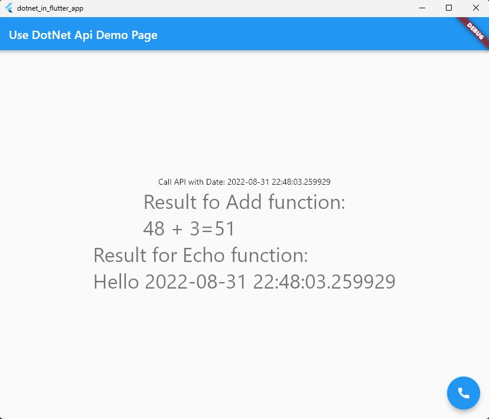

# dotnet_in_flutter_app

A Flutter project who use Dotnet API

The DotNet API is exposed with a COM Interface who export two methods.

The first method calculate an addition of 2 integers and return a result inside a pointer of Integer.

The second method implement an echo of the string method parameter and return a result inside a pointer of (Utf8 char).

## register COM object

Build .Net project solution with dotnet build, it generate a new file named "MyDotNetApi.comhost.dll".

This file must be register inside COM references via regsrv32 command.
For register COM library, we need open an DOS command and execute this command in Administrator mode:

`regsvr32 MyDotNetApi.comhost.dll`

For unregister COM library, we need open an DOS command and execute this command in Administrator mode:

`regsvr32 /u MyDotNetApi.comhost.dll`

## Preview of Flutter application

